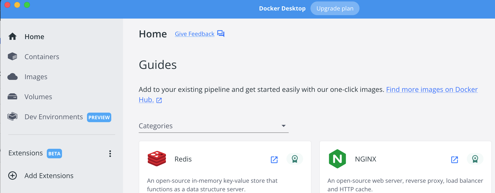
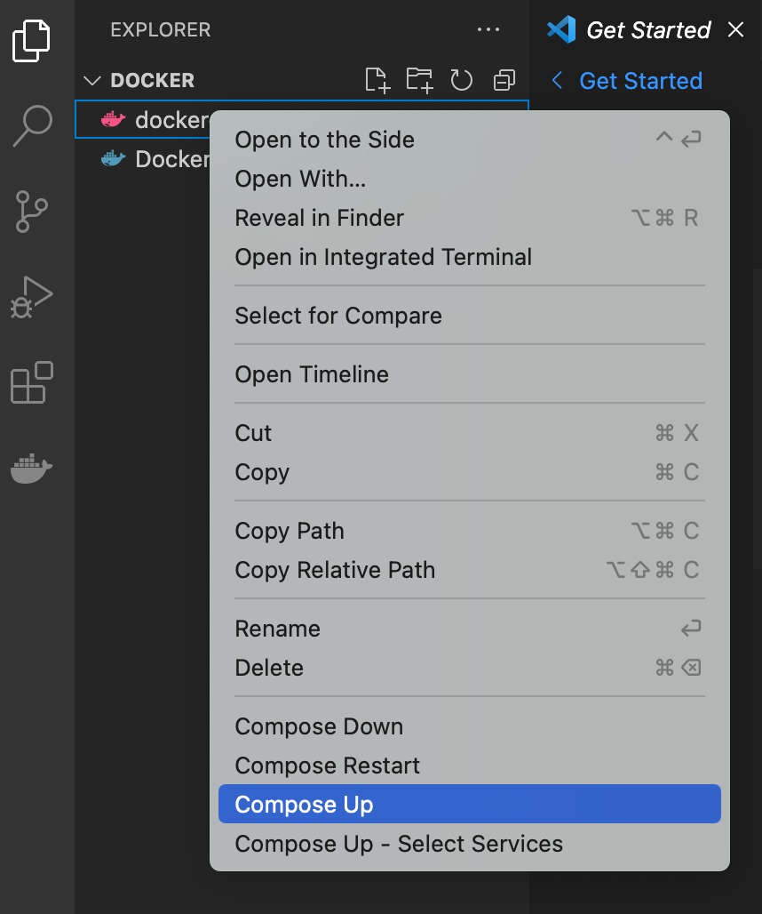
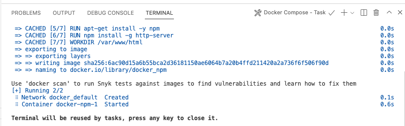

# S2-Docker
Docker will allow you to have the same webserver system on your laptop that you will be using on your cloud web server.  We will get you started with Docker in this tutorial, but we hope you will continue to develop your ability to use it throughout the class.  This tutorial will show you how to install Docker and use it to spin up a web server on your laptop or desktop.
1. Download Docker Desktop for the [operating system](https://docs.docker.com/get-started/) you are using on your laptop or desktop system. 
2. Run Docker.  You should see the Docker Welcome Screen.
  
4. Download the [docker.zip](docker.zip) file by selecting the download button.

3. Unzip the docker.zip file in your Downloads folder.  
4. Open the docker directory in vscode, and you should be able to see the files "docker-compose.yml" and "Dockerfile" on the left panel in vscode.  


5. Make sure that you have docker desktop running.  
6. Right click on the docker-compose.yml and if you have the Docker extension installed, you should see an option to "compose up".  Select this option.  

7. When the server has been created, you should be able to see the output in the terminal window.

8. The docker web server is configured to serve files that are in the "public_html" folder on your laptop or desktop.  In your vscode window select file/open/newfolder and select "public_html" as the name of the new folder.
9. Create a new file in this folder and name it "index.html".  This is the default file that will be displayed by the docker web server.  Copy and paste this content into your "index.html" file.
```html
<html>
  <h1> Hello World </h1>
</html>
```
