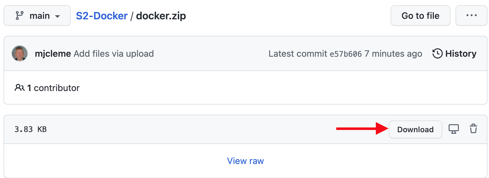
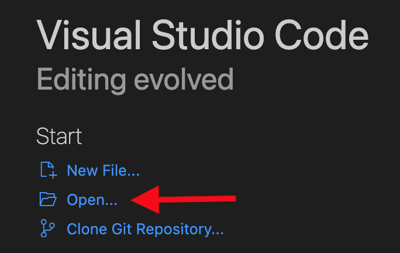
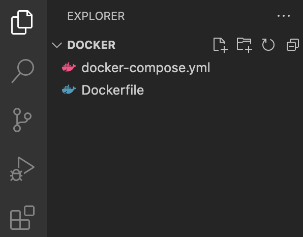

# S2-Docker
Docker will allow you to have the same webserver system on your laptop that you will be using on your cloud web server.  We will get you started with Docker in this tutorial, but we hope you will continue to develop your ability to use it throughout the class.  This tutorial will show you how to install Docker and use it to spin up a web server on your laptop or desktop.
1. Download Docker Desktop for the [operating system](https://docs.docker.com/get-started/) you are using on your laptop or desktop system. 
2. Download the [docker.zip](docker.zip) file by selecting the download button.

3. Unzip the docker.zip file in your Downloads folder.
4. Open the docker directory in vscode, and you should be able to see the files "docker-compose.yml" and "Dockerfile" on the left panel in vscode.

